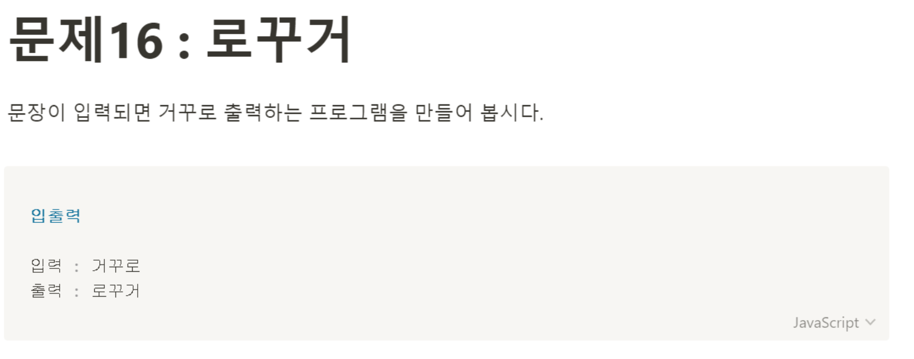

# 문제16: 로꾸거


```javascript
let oldSentence = prompt('문장을 입력하세요.');

function reverseSentences(sentence) {
    let newSentence = '';
    for(let i = 0; i < sentence.length; i++) {
        newSentence = sentence[i] + newSentence;
    }
    document.write(newSentence);
}

reverseSentences(oldSentence);
````


prompt로 문장을 받아와서 for문으로 문장을 거꾸로 출력하는 함수를 만들어 해결했다. 
