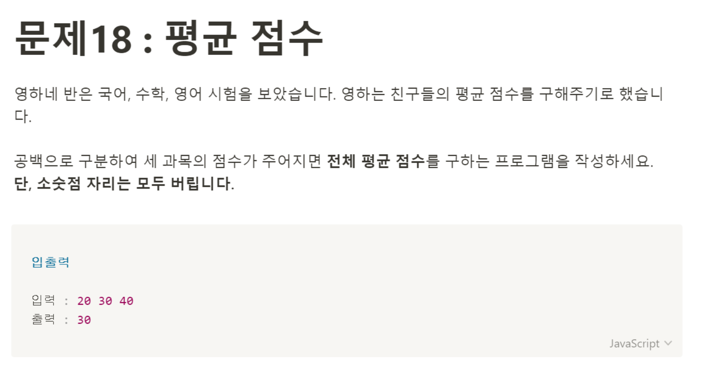

# 문제 18: 평균 점수 



공백을 구분한다는 말이 어렵게 느껴져서 일단,
숫자가 이미 담긴 배열을 만들어서 평균 점수를 계산하는 함수를 만들었다. 
```javascript
let score = ['82', '70', '95'];

 function averageScore(score) {
     return Math.floor((parseInt(score[0]) + parseInt(score[1]) + parseInt(score[2])) / 3);
}

console.log(averageScore(score));
```
이렇게 작성하고 보니, for문을 이용해 좀 더 깔끔하게 만들어 줄 수 있을 것 같아 다시 for문으로 코드를 작성했다.
```javascript
let score = ['82', '70', '95'];

function averageScore(score) {
    let sum = 0;
    for(let i = 0; i < score.length; i++) {
        sum += parseInt(score[i]);
    }
    return Math.floor(sum / score.length);
}

console.log(averageScore(score));
```
이제 점수를 받아와서 처리하도록 코드를 바꿔줘야 하는데,,
처음에는 prompt로 받은 점수들을 바로 배열로 넣어줬다.
```javascript
let score = [prompt('점수를 입력하세요')];
score.split(' ');
````
배열로 받은 socre를 공백을 기준으로 구분하려고 split을 썼는데, 이게 안먹어서 mdn에 찾아보니,, split은 String에서 쓸 수 있는 API였던 것이다,, 그래서 받은 점수들을 모조리 socre에 넣어서 score를 공백으로 구분하여 새로운 배열로 만들어주는 코드를 작성했다.
```javascript
let score = prompt('점수를 입력하세요');
let scoreArray = score.split(' ');

console.log(scoreArray); // ['40', '50', '60']
````

그리고 함수부분은 아까 작성했던 것과 같이 작성해주었다. 

```javascript
let score = prompt('점수를 입력하세요');

let scoreArray = score.split(' ');

function averageScore(score) {
    let sum = 0;
    for(let i = 0; i < score.length; i++) {
        sum += parseInt(score[i]);
    }
    console.log(sum);
    return Math.floor(sum / score.length);
}

console.log(averageScore(scoreArray));
````
split함수에 대해서 다시 한번 알게되었던 문제 풀이였다.
