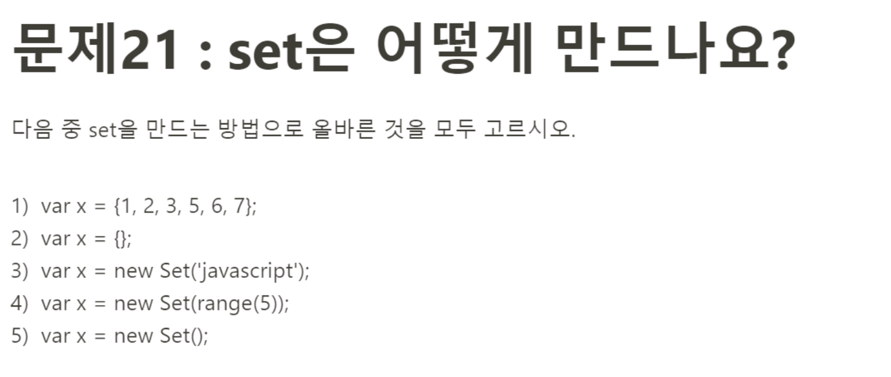

# 문제 20: set은 어떻게 만드나요?



우선 set이 뭔지 알아보자
<storng>set</storng> 객체는 데이터의 집합체 이며, 중복이 불가능한 자료구조이다. 
set은 배열과 유사하지만 확실한 차이점이 있다.

|구분|배열|Set객체|
|------|---|---|
|동일한 값 중복|가능|불가능|
|요소 순서에 의미|있음|없음|
|인덱스로 요소 접근|가능|불가능|

Set객체는 다음과 같이 생성할 수 있다.
```javascript
const set = new Set();
console.log(set); // Set(0) {size: 0}
```
Set객체는 이터러블을 인수로 전달받는데, 이때 전달받은 이터러블에 중복 값이 있다면 제외된다. 
<br>
>문자열은 이터러블이면서 유사객체이므로 3번은 정답이다. <br>
5번은 Set객체를 만드는 가장 기본적인 방법이므로 정답이다. <br>
따라서 정답은 3번과 5번 

Set 객체의 기본을 다시 생각해볼 수 있는 문제 풀이였다.! 
