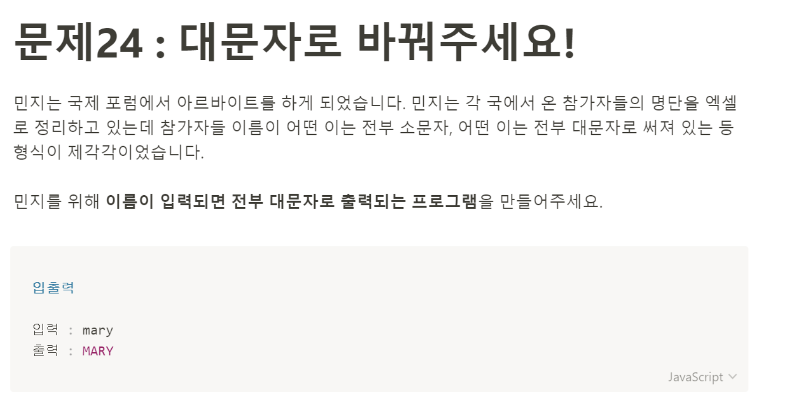

# 문제 24: 대문자로 바꿔주세요!



```javascript
let name = prompt('Put your name here.');

function changeUpperCase(name) {
  let reName = name.toUpperCase();
  return reName;
}

document.write(changeUpperCase(name));
```

`prompt`로 이름을 받아서 String의 `toUpperCase`메서드를 이용해서 문제를 해결했다. String 메서드를 다시 한번 떠올릴 수 있었던 문제풀이였다.
