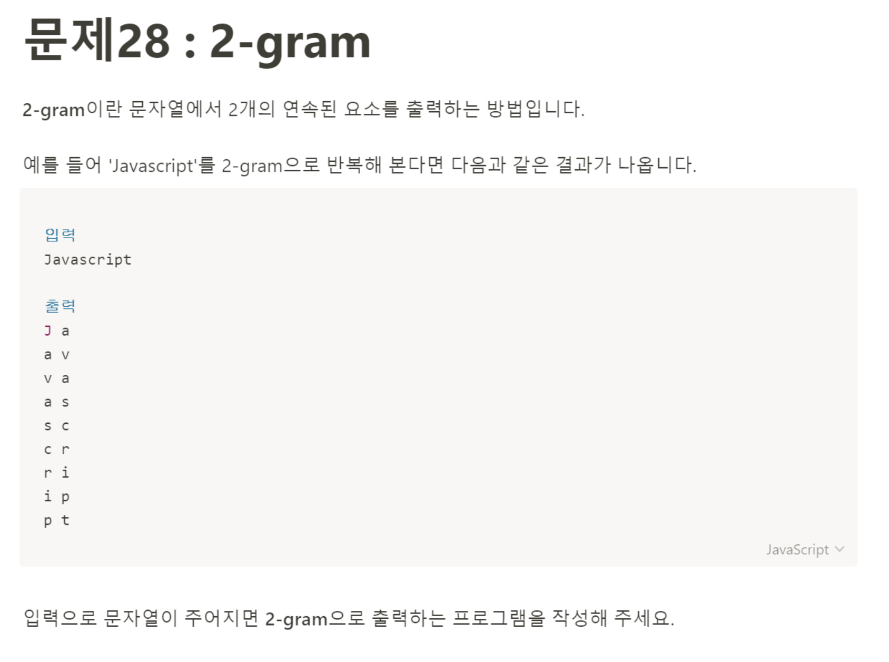

# 문제28: 2-gram



```javascript
let word = prompt('띄어쓰기 없이 문자열을 입력하세요');

for(let i = 0; i < word.length - 1; i++) {
    console.log(word[i], word[i + 1]);
}
````
보자마자 어떻게 풀어야할지 감이 안왔다. 그래서 일단 솔루션을 먼저 봤는데, 허무하게도 반복문을 돌리는 게 끝이었다.
그냥 한 번 출력할 때 현재 ```i```번째의 문자열과 ```i + 1```번째의 문자열을 같이 출력하면 되는 일이었다. 문제의 출력 예시에 J가 하이라이팅 되어있어서 뭔가 특별한 풀이 방법이 있는 줄 알았다. 다음부터는 문제를 잘 해석하자.