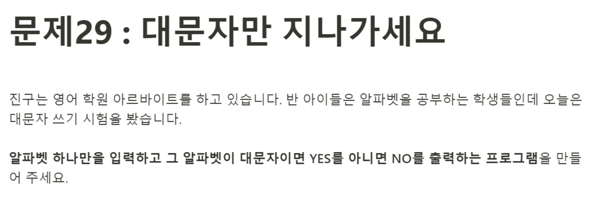

# 문제29: 대문자만 지나가세요



```javascript
const alphabet = prompt('알파벳 하나를 입력하세요');

function isCapital(word) {
    if(word == word.toUpperCase()) {
        document.write('YES');
    } else {
        document.write('NO');
    }
}

isCapital(alphabet);
````
일단 문제를 보고 ```toUpperCase```메서드가 바로 떠오르긴 했는데, 어떻게 비교하면 좋을 지 고민이 됐다.
그래서 구글에 "how to check capital js method"라고 검색해봤고, 바로 답을 찾았다. 전달받은 인자의 알파벳 값과 전달받은 인자를 ```toUpperCase```한 값을 비교해볼 수 있다는 힌트를 얻고, ```if문```으로 작성했다. 
