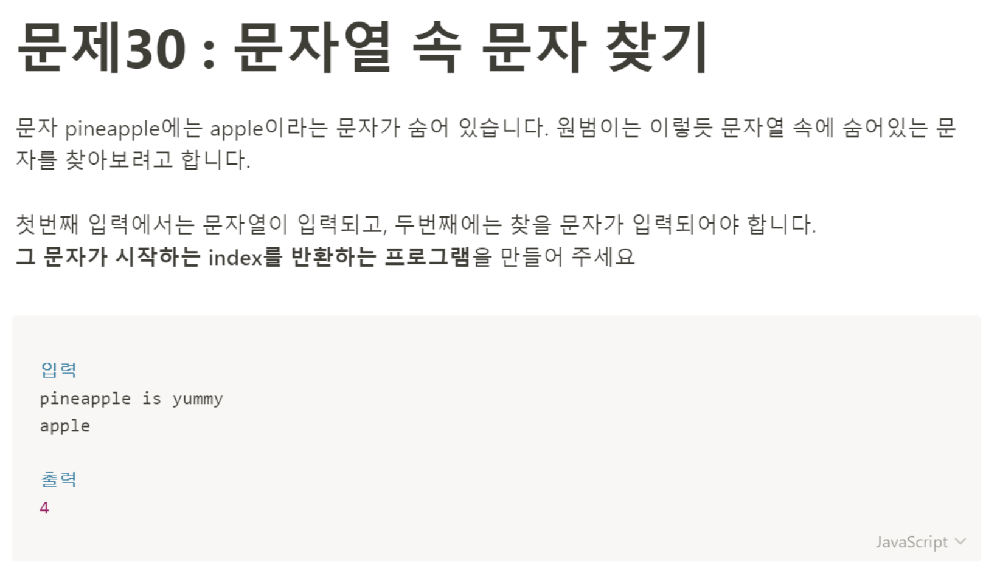

# 문제 30: 문자열 속 문자 찾기



```javascript
// 잘못된 코드

let sentence = 'I want a girl';
let findWord = 'girl';

const answer = sentence.indexOf(findWord);

console.log(answer); // 9????
```

문제를 읽고 `findIndex` 메서드를 사용하면 될 것 같은데 하는 생각이 들었다. 이 방법을 사용하니까 findIndex is not function이라는 에러가 떴다. 왜냐면 `findIndex` 메서드는 String이 아니라 Array에 있는 메서드이기 때문이다. 인덱스를 뽑아 내주는 다른 메서드를 찾아보다 `indexOf` 메서드를 찾았는데 결과 값은 내가 예상한대로 나오지 않았다. 왜 9가 나왔지?? 내가 예상한 결과 값은 3이었다.

mdn에서 `indexOf`를 읽어보니까 배열에 들어있는 문자열 중에 같은 문자열의 index를 찾는 예제 코드가 있어서 sentence를 배열로 바꾸어봤는데, 내가 원하는 결과 값이 도출되었다.

```javascript
// 실험 코드
let sentence = ['I', 'want', 'a', 'girl'];
let findWord = 'girl';

const answer = sentence.indexOf(findWord);

console.log(answer); // 3
```

헐 아니 내가 문제를 잘못 이해했구나 찾을 문자가 시작되는 인덱스를 받아오는 문제였다. 그리고 9가 나왔던 코드에서 문자열은 공백도 하나의 인덱스이기 때문에 포함되어 카운트 되었던 것이다. 그래서 9가 결과값으로 도출되었던 것...!
그리고 `indexOf`메서드는 String, Array 둘다 메서드로 가지고 있어서 내가 둘 다 사용했을 때 결과 값을 얻을 수 있었던 것이다.

이 문제는 `indexOf`메서드를 사용해 쉽게 풀 수 있는 문제였다.
