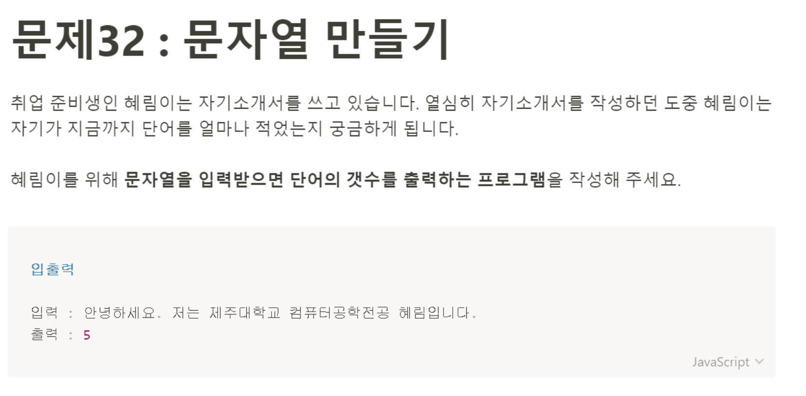

# 문제 32: 문자열 만들기



```javascript
const getSentence = prompt('문자열을 입력하세요');
const makeArray = getSentence.split(' ');

console.log(makeArray.length);
```
어떻게 풀면 좋을까 고민하다 앞 문제들에서 ```prompt```로 받은 문자열을 split을 이용해 배열로 바꿔서 풀었던 기억이 나서 그걸 사용해보기로 했다. 생각보다 쉽게 풀었다. 처음 읽었을 때는 단어 하나 하나를 어떻게 카운트 하지, 한글인데 무슨 처리를 또 해줘야 하나 싶었지만 그렇게까지 꼬인 문제는 아니었다는.. 
