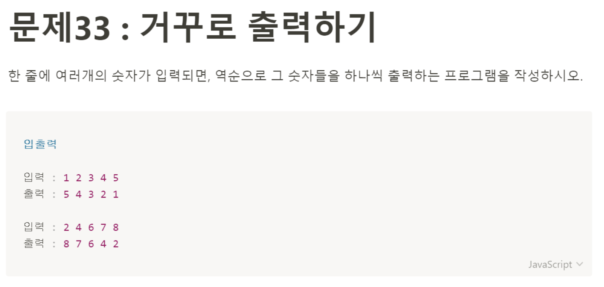

# 문제 33: 거꾸로 출력하기 



```javascript
let numbers = prompt('숫자를 입력하세요.(단 숫자 사이에는 공백을 한 칸 넣어주세요)').split(' ');

let reverseNumbers = [];

function makeReverse() {
    for(let i = 0; i <numbers.length; i++) {
        reverseNumbers.unshift(numbers[i]);
    }
}

function popNumbers() {
    for(let i = 0; i <reverseNumbers.length; i++) {
        console.log(reverseNumbers[i]);
    }
}

makeReverse();
popNumbers();
````
> Parameters

함수에 아무런 arguments도 주어지지 않는다. 
>Return

리턴 값이 없는 함수고, 함수 안에서 반복문만 수행한다. 

>Pseudocode

일단 값을 받아와야 하니까 prompt를 이용해서 받아올 것이다. prompt로 받아오면 입력한 값 자체를 string문자열로 받아오는데 이 값을 그대로 반복문을 돌려서 하나씩 출력하면 입력한 공백도 같이 출력이 된다.
그래서 공백을 포함해 받은 숫자들을 ```split```메서드를 사용해서 공백을 기준으로 잘라 새로운 배열로 만들어 변수에 할당을 했다. 그리고 빈 배열을 하나 새로운 변수에 할당하였다. 이 빈 배열은 전달받은 숫자 값을 반복문을 돌려서 ```unshift```를 사용해 하나씩 넣어줄 예정이다. ```unshift```는 배열의 맨 앞에 값을 추가하는 메서드이기 때문에 전달받은 값을 새로운 배열에 순서를 거꾸로 저장할 수 있다.
그 다음 거꾸로 순서를 재배치한 배열을 다시 하나씩 앞에서부터 출력해주는 함수에서 반복문을 사용해 콘솔에 하나씩 출력해주었다. 
 
 > 해설 강의 보고 디벨롭한 내용

전달 받은 값을 순서를 거꾸로 하는 배열을 만들기 위해 ```makeReverse```함수를 만들었고 함수 안에서 반복문을 사용해 unsift로 빈배열에 값을 넣어주었다. 근데,, Array 메서드에 ```reverse```라는 함수가 있었다.! <br />
그리고 문제가,, 5 4 3 2 1 <- 이렇게 한 줄로 출력하는 거였다. 나는 하나씩 한 줄인 줄 알았는데, 대체 왜 문제를 보고도 제대로 해석을 못하는 걸까?
<h3 style="color: cornflowerblue; font-size: 24px">수정한 코드</h3>

```javascript
let numbers = prompt('write any numbers between space').split(' ').reverse();

let reverseNumbers = "";

function newArray() {
    for(let i = 0; i <numbers.length; i++) {
        reverseNumbers += numbers[i] + ' ';
    }
    console.log(reverseNumbers);
}

newArray();
```
숫자 값을 전달 받아서 바로 배열로 바꾸고 순서를 리버스 한 것까지 numbers 변수에 할당을 해주었고,
```reverseNumbers```변수에 빈 배열을 할당해 놓고 ```newArray```함수를 만들어 ```numbers```변수 배열의 값을 하나씩 ```reverseNumbers```변수에 할당해준다. 그리고 출력하면 끝!<br /> 내 첫 번째 풀이는 내가 reverse메서드를 만들어서 푼 셈이구나. 