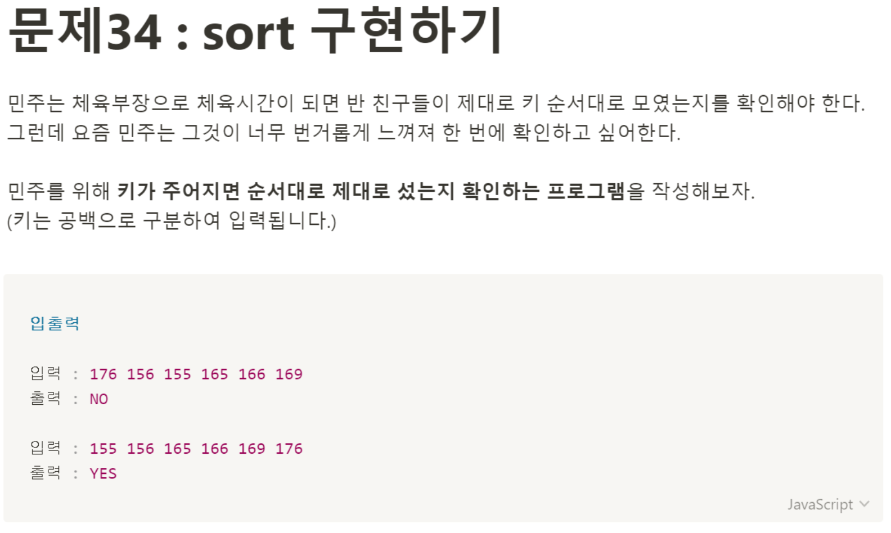

# 문제 34: sort 구현하기 



```javascript
const heights = prompt('공백으로 구분하여 키를 입력하세요.').split(' ');

function sortCheck() {
    let yesNumber = 0;
    for(let i = 0; i < heights.length; i++) {
        if(heights[i] <= heights[i + 1]) {
            yesNumber++;
        }
    }
    if(yesNumber === heights.length -1) {
        return "YES"
    } else {
        return "NO"
    }
}

console.log(sortCheck());
````
> Parameter

숫자 값을 입력받지만 ```propmt```로 입력받는 값은 모두 string으로 받아와진다. 

> Return 

for 반복문의 결과를 판단해 문자열 'YES'나 'NO'를 리턴한다. 

> Pseudocode

키(height)값을 받아와야하니까 일단 prompt를 만들어서 값을 받자마자 공백을 기준으로 값을 잘라서 배열을 만들고 새로운 변수에 할당해줄거다. 그 다음 전달 받은 값으로 만든 배열을 for 반목문을 사용해서 앞의 값과 뒤의 값을 비교해준다. ```yesNumber```이라는 변수를 만들어서 0으로 값을 초기화 해준다음에 조건에 맞으면 값을 1씩 증가시켜준다. 그리고 나중에 ```yesNumber```변수와 전달받은 값의 배열의 길이 -1 값을 비교해서 값이 같으면 키가 작은 순서대로 잘 섰다는 말이니까 'YES'를 반환하고, 값이 같지 않으면 (yesNumber가 더 작을경우) 'NO'를 반환하는 함수를 만들었다.

 > 해설 강의 보고 디벨롭한 내용

 ```sort()```메서드 사용.. 천재인가 난 진짜 문제대로 내가 구현해야하는 줄 알았다.
 ```javascript
    // 강사님 코드 
    // const numbers = '155, 156, 164, 177';
    const unsorted = prompt();
    let sorted = '';
    sorted = unsorted.split(' ').sort(function(a, b) {
        return a - b;
    }).join(' ');

    if(unsorted === sorted) {
        console.log('YES);
    } else {
        console.log('No');
    }
 ```

```sort()```메서드 안에 위 코드의 함수를 넣으면 ```a: 155, b: 156```값을 받아오고 a - b값을 구한 후 음수 값이면 b가 a보다 작으니까 순서를 b, a로 다시 배치한다. 이걸 배열의 모든 수에 실행하고 정렬된 배열을 다시 문자열로 만들어 준 후 전달받은 문자열과 일치 여부를 비교한 후 일치하다면 'YES'값을 일치하지 않는다면 'NO'값을 반환한다.
확실히 간편하다. 나처럼 ```yesNumber```같은 변수를 만들지 않아도 되고. 근데 뭔가 내 풀이도 나쁘지 않은 것 같은 느낌? 알고리즘 문제를 풀면서 항상 느끼는거지만 세상엔 정말 다양한 풀이법이 있구나. sort함수에 대해 다시 한번 공부해볼 수 있는 기회였다. 
