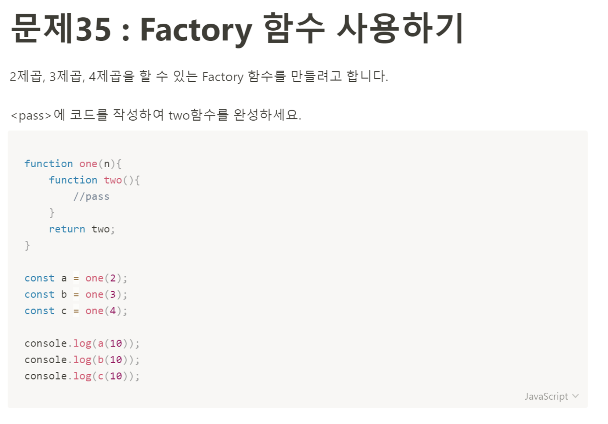

# 문제 35: Facotory 함수 사용하기



```javascript
function one(n){
    function two(){
        return n * n
    }
    return two;
}

const a = one(2);
const b = one(3);
const c = one(4);

console.log(a(10));
console.log(b(10));
console.log(c(10));
````
나는 왜 이렇게 생각이 깊지 못할까 앞 문제부터 지금까지 다 문제와 어긋나게 풀고있다. a, b, c변수에 담기는 함수는 one함수를 실행했을 때 리턴되는 two함수이고, a함수에 전달된 인자들은 각각 2제곱, 3제곱, 4제곱을 뜻하는 거였다.
결국 얻고싶은 값은 10의 2제곱, 10의 3제곱, 10의 4제곱이었다. 그럴려면 위 처럼 푸는게 아니라 다르게 풀어줘야겠지.
```javascript
function one(n){
    function two(x){
        return Math.pow(x, n); 
        // x ** n; 라고 할 수도 있다.
    }
    return two;
}

const a = one(2);
const b = one(3);
const c = one(4);

console.log(a(10));
console.log(b(10));
console.log(c(10));
```
two함수에서 받아올 수 없는 n은 one함수까지 올라가서 받아올 수 있겠지. 스코프 체인 개념으로 설명해볼 수 있을 것 같다. 하위 스코프(two함수)에서 상위스코프(one함수)의 변수를 찾아서 갖다 쓴것이다. 