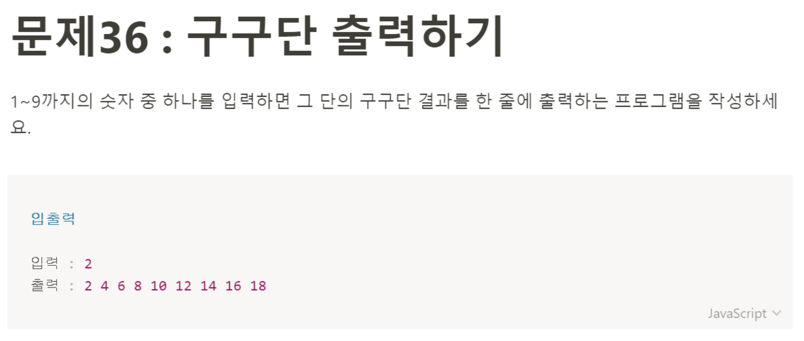

# 문제 36: 구구단 출력하기



```javascript
const number = parseInt(prompt('숫자를 입력하세요.'));

function printMultiplication(number) {
    let multiplication = ' ';
    for(let i = 1; i < 10; i++) {
        multiplication += number * i + ' ';
    }
    console.log(multiplication);
}

printMultiplication(number);
```
> Parameter

숫자 값을 받아와야 한다. ```prompt```를 사용해서 값을 받으면 string으로 받아오기 때문에 ```parseInt()```를 사용해서 number로 타입을 변경해줬다. 사실 이렇게 하지 않아도 오류는 안나는데, 정확한 코드 작성을 위해 처리해주었다. 

> Return 

for반복문을 사용하여 전달받은 인수를 1씩 증가하는 i와 곱한 값을 새로운 변수에 하나씩 추가한 ```multiplication```변수를 반환한다.

> Pseudocode

일단 prompt로 숫자를 입력받아서 변수에 할당할해줄거다. 단 prompr로 받은 값은 string타입이기 때문에 parseInt()를 사용해서 number타입으로 변환한 후 ```number```변수에 할당해줄 것이다. 그 다음 ```printMultiplication```함수의 인자로 ```number```변수를 넘겨주고, 함수안에서 구구단으로 만든 변수를 할당해줄 새 변수 ```multiplication```을 선언하고 빈 스트링 값으로 초기화 해준다. 그 다음 for반복문을 돌릴건데 i는 1부터 9까지 돌면서 전달받은 인자와 곱해준다. 하나씩 곱하면서 새 변수 ```multiplication```에 할당한다. 빈 스트링이랑 숫자를 더했기 때문에 암묵적 타입 변환으로 ```multiplication```변수에 하나씩 할당될때 string으로 변환되어 할당된다. for반복문이 끝나고 ```printMultiplication```함수는 전달 받은 수의 구구단이 들어있는 ```multiplication```변수를 최종적으로 리턴한다. 
