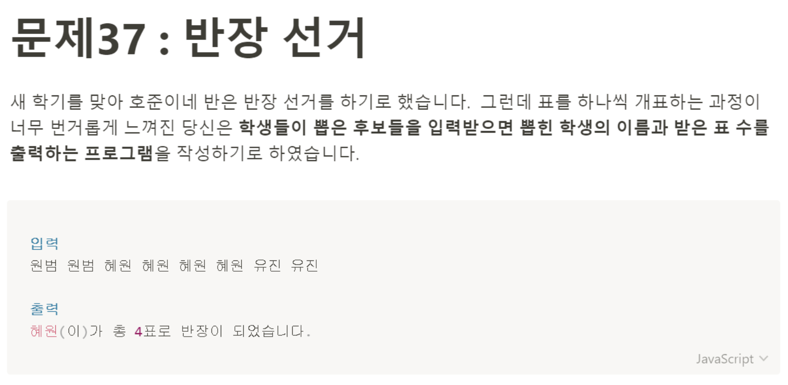

# 문제 37: 반장 선거



```javascript
const peopleArray = prompt('총 이름들을 공백을 포함하여 입력하세요').split(' ');
let result = {};
let winner = '';

for (let peopleIndex in peopleArray) {
    let value = peopleArray[peopleIndex];
    result[value] = result[value] === undefined ? 1 : result[value] = result[value] + 1;
}

console.log(result);
console.log(Object.keys(result));

winner = Object.keys(result).reduce((a, b) => {
    return result[a] > result[b] ? a : b;
})

console.log(`${winner}(이)가 총 ${result[winner]}표로 반장이 되었습니다.`);

````

오늘 문제는 풀이방법이 생각나지 않아서, 인프런에서 해설강의를 먼저 봤다.
<br/>
```reduce()```메서드에서 콜백함수의 파라미터로 들어오는 것들을 출력했을 때 이해가 잘 안가서 한참 구글링하고 딥다이브도 읽었다. ```reduce()```메서드는 한 번 순회할 때마다 앞에서 누적되어온 값이랑 현재 값 두 개를 써서 그냥 값을 출력하면 두 개가 동시에 나오는거 같다.