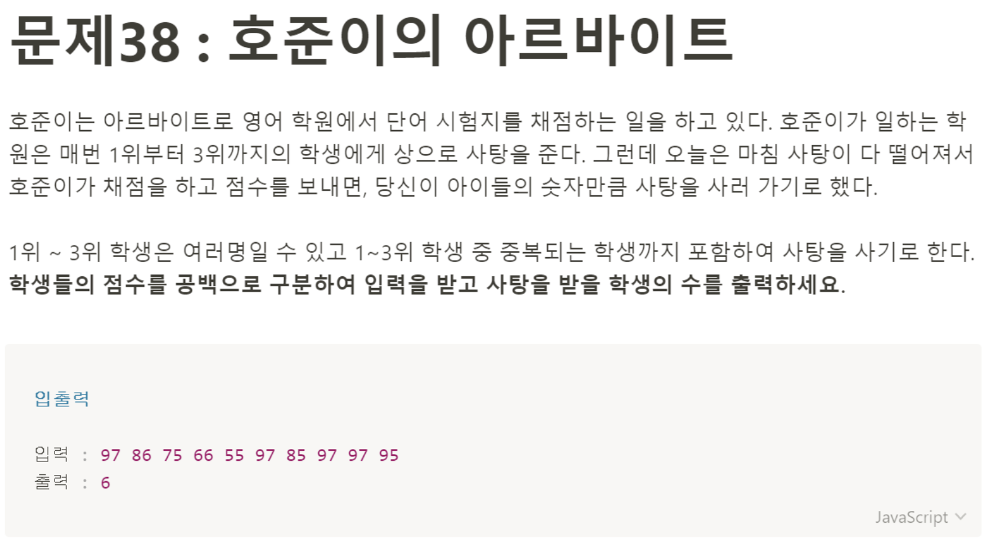

# 문제 38: 호준이의 아르바이트



```javascript
const grade = prompt('공백을 포함해 점수를 입력하세요').split();

grade.sort((a, b) => {
    return a - b;
})

let top3 = [];
let count = 0;

while(top3.length < 4) {
    let value = grade.pop();
    if(!top3.includes(value)) {
        top3.push(value);
    }
    count++;
}
console.log(top3);
console.log(count - 1);
````
받아온 점수 값을 내림차순으로 정렬까지는 했는데 top3점수를 구하는데서 막혔다. 그래서 마무리는 해설 강의를 봤다. 