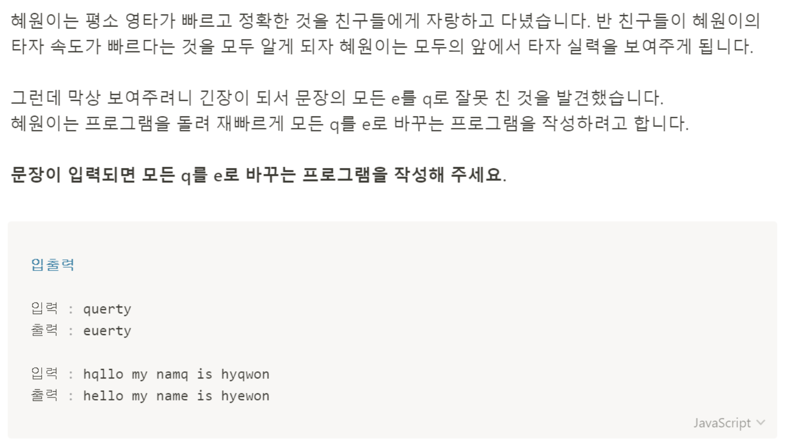

# 문제 39: 오타 수정하기



```javascript
const sentence = prompt('write any sentence. it changes to e from q');
let newSentence = '';

function replacement(sentence) {
    newSentence = sentence.replaceAll('q', 'e');
    console.log(newSentence);
}

replacement(sentence);

````
생각보다 간단하게 풀렸던 문제. 

> Parameter

string값을 받아와야 한다.
prompt로 받아와서 string값으로 받아와짐.

> Return

```replacement```함수 안에서 ```replaceAll```메서드를 사용하여 ```newSentence``` 변수에 할당한 후 ```newSentence```변수를 로그로 출력한다.

> Pseudocode

prompt로 문자열 값을 string으로 받아온 후 ```replacement```함수의 인자로 전달한다. 함수 안에서  ```replaceAll```메서드를 사용하여 인자로 받은 문자의 모든 q를 e로 바꾼 후 ```newSentence``` 변수에 할당한 후 console log로 출력한다. 
