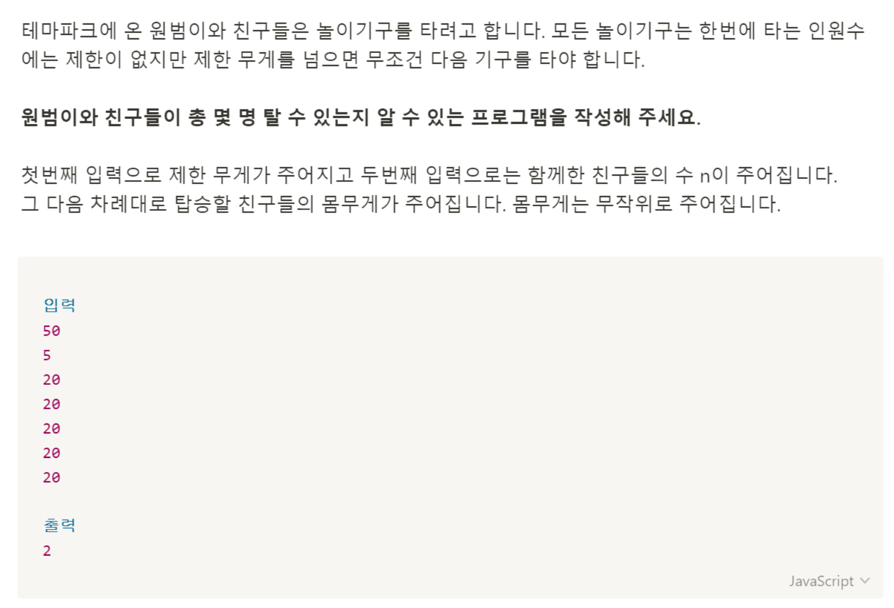

# 문제 40: 놀이동산에 가자



```javascript
const weights = prompt('제한 몸무게, 인원수, 몸무게들을 입력하세요').split(' ');

let limitWeight = parseInt(weights[0]);

let newWeights = [];

let sumWeights = 0;

let countPeople = 0;

// 몸무게만 새로운 배열로 만들기 
for(let i = 2; i < weights.length; i++) {
    newWeights.push(weights[i]);
}

newWeights.sort((a, b) => {
    return a - b;
})

for(let i = 2; i < newWeights.length; i++) {
    if(limitWeight > sumWeights) {
        sumWeights += parseInt(weights[i]);
        if(limitWeight < sumWeights) {
            break;
        }
        countPeople++;
    }
}


console.log(sumWeights);
console.log(`${countPeople}명 탈 수 있습니다.`);
````
> Parameter

제한 몸무게와 총 인원수 그리고 각 인원의 몸무게를 prompt로 받아온다. 

> Pseudocode


string값으로 받자마자 ```split```메서드를 사용해 ```weights```변수에 할당한다. 제한 몸무게는 우선 ```limitWight```에 할당해주고, for문을 사용하여 몸무게들만 모아서 새로운 배열로 만들어 ```newWeights```에 할당한다. 그다음 ```sort```메서드를 이용해서 ```newWeights```배열의 몸무게들을 크기별로 재정렬한다. 재정렬을 해주는 이유는 숫자가 무작위로 받아와질텐데 처음부터 큰 수 끼리 더해서 제한 몸무게를 넘어버리는 경우가 생기거나 탈 수 있는 인원이 정확히 카운팅 되지 않을 수 있기 때문이다. 재정렬된 몸무게들의 배열을 for문을 돌리는데 if문으로 제한 몸무게보다 작으면 ```sumWeights```변수에 누적해서 더해준다. 단 if문을 중첩으로 작성해서 돌리는 와중에 누적되고 있는 몸무게가 제한 몸무게 보다 넘어가면 if문을 빠져나오도록 한다. 그리고 sumWeights에 더해질 때마다 0으로 초기화 해둔 ```countPeople``` 변수를 1씩 증가시켜 가능한 인원을 카운트 한다.