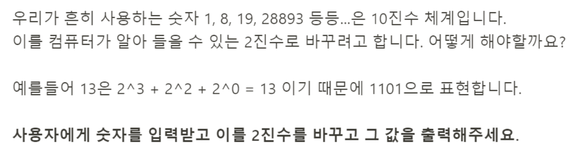

# 문제 43: 10진수를 2진수로



```javascript
let decimal = 13;

console.log(decimal % 2 );

console.log(Math.floor(decimal / 2));

console.log(Math.floor(decimal / 2) % 2);

console.log(Math.floor(Math.floor(decimal / 2) / 2));

console.log(Math.floor(Math.floor(decimal / 2) / 2) % 2);

console.log(Math.floor(Math.floor(Math.floor(decimal / 2) / 2) / 2));
```

이렇게 까지 생각을 하고 어떻게 구현하지 if문으로 예외처리를 해줘야하나 하고 고민을 하다가 강의를 봤다. 요즘 강의 너무 많이본다. 
```javascript
let decimal = prompt('숫자를 입력하세요');

let arrayBinary = [];

while(decimal) {
    let binary = decimal % 2;
    arrayBinary.push(binary);
    decimal = Math.floor(decimal / 2);
}
console.log(arrayBinary.reverse().join(''));
````

decimal을 2로 나눈 후 새로운 몫을 다시 저장해준다니.. 생각지도 못한 방식이었다. 
