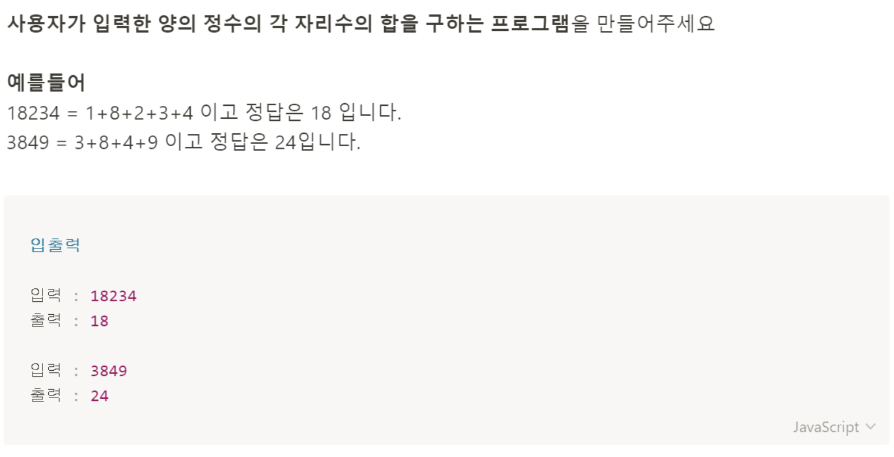

# 문제 44: 각 자리수의 합



```javascript
const number = prompt('양의 숫자를 입력하세요.');

let plusNumber = 0;

for(let i = 0; i < number.length; i++) {
    plusNumber += parseInt(number[i]);
}

console.log(plusNumber);
```
> Parameters

항상 string 값으로 숫자를 받는다. 

> Return

함수로 작성하지 않았기 때문에 리턴 값은 없음. 함수로 작성한다면 return값은 각 자릿수의합인 Number타입인 숫자가 될것임.

> Psuedocode

prompt를 사용해 사용자에게 양의 정수를 받는다. 받은 숫자를 for문으로 돌리면서 각 자릿수의 합을 구할 건데, 새로 구한 각 자릿수의 합 값을 할당할 새로운 변수 plusNumber를 선언하고 숫자 0을 할당해놓는다. prompt로 받은 number를 for문으로 반복하면서 각 자리의 숫자를 plusNumber에 축적하여 더한다. 
그 다음 plusNumber를 콘솔로 출력한다. 