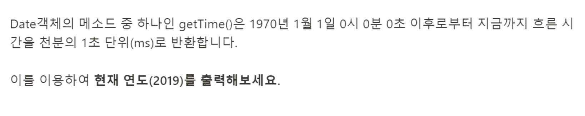

# 문제45: getTime()함수 사용하기



```javascript
const getTime = new Date().getTime();

console.log(Math.floor(getTime / (1000 * 60 * 60 * 24 * 365)) + 1970);

````
> 풀이과정

어떻게 풀어야할지 감이 안와서 구글링을 했다. <br/>
1970년도 부터 현재까지의 시간들이 밀리세컨드의 값으로 출력되니까, 그 시간들을 년 수로 바꿔보았다. 그리고 1970년을 더해 값을 구했다. 
