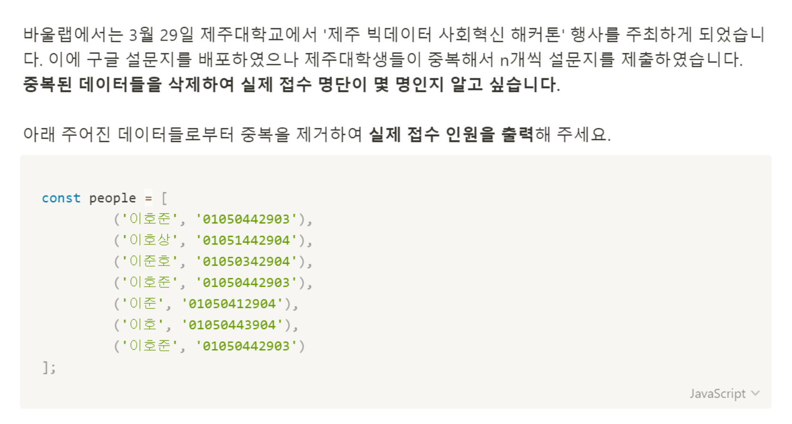

# 문제 47: set 자료형의 응용



```javascript
const people = {
  이호준: '01050442903',
  이호상: '01051442904',
  이준호: '01050342904',
  이호준: '01050442903',
  이준: '01050412904',
  이호: '01050443904',
  이호준: '01050442903',
};

let result = new Set();

for (let key in people) {
  result.add(key);
}

console.log(result.size);
```
Set 자료구조는 중복 값을 저장할 수 없다.
객체의 key값을 하나씩 뽑아서 새로 만든 Set 객체에 더해주고 
그 size를 구해 답을 구했다.